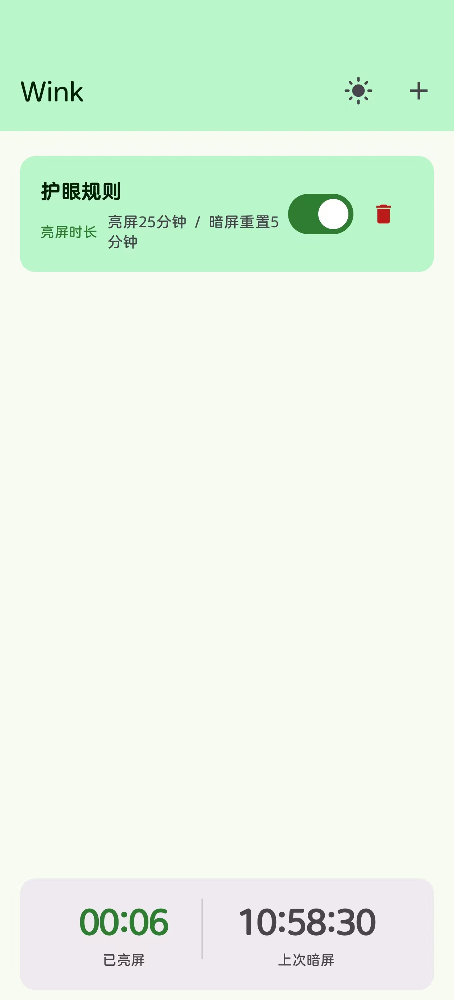
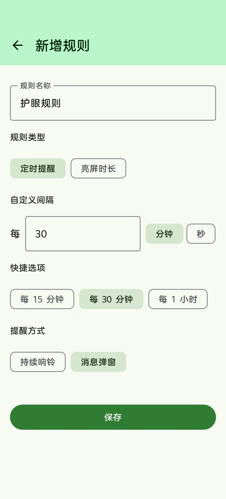
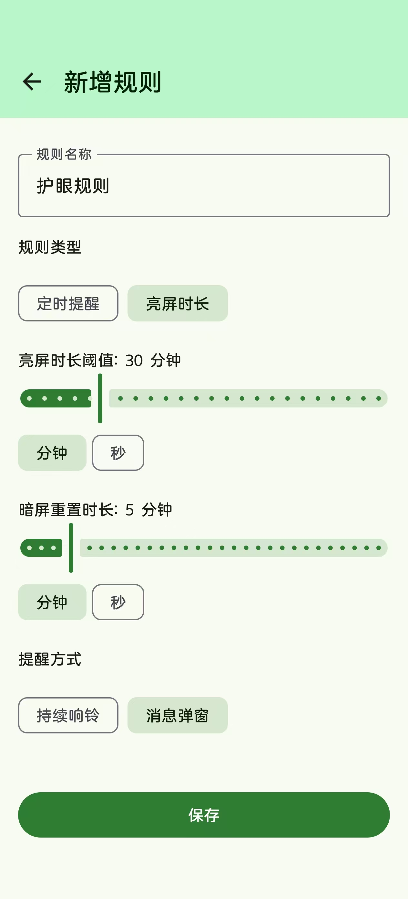
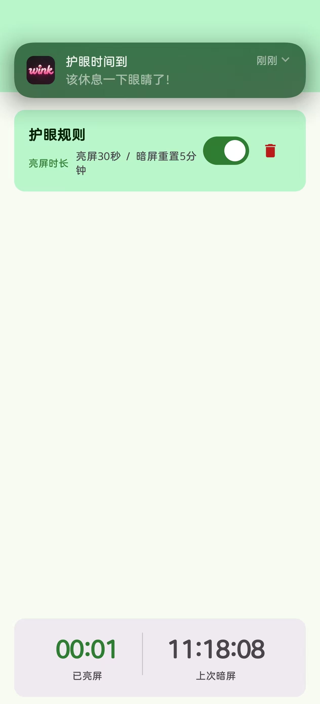
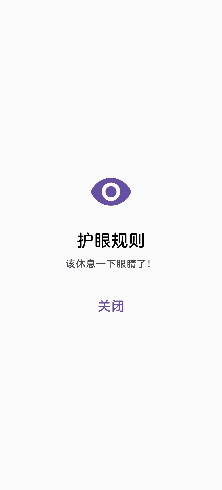
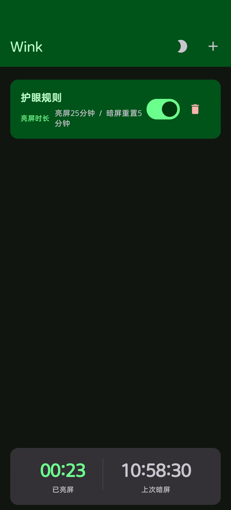

# Wink - 护眼提醒

一款 Android 护眼提醒应用，通过定时提醒和亮屏时长监控，帮助你养成健康用眼习惯。

## 界面预览

<table>
  <tr>
    <td align="center"><b>首页</b></td>
    <td align="center"><b>规则-定时提醒</b></td>
    <td align="center"><b>规则-亮屏时长</b></td>
    <td align="center"><b>提醒-弹窗提醒</b></td>
    <td align="center"><b>提醒-全屏提醒</b></td>
    <td align="center"><b>暗色模式</b></td>
  </tr>
  <tr>
    <td></td>
    <td></td>
    <td></td>
    <td></td>
    <td></td>
    <td></td>
  </tr>
</table>

### 首页

规则列表一目了然，卡片式布局展示每条规则的名称、类型和参数。底部实时显示已亮屏时长和上次暗屏时间，每秒自动刷新，让你随时掌握用眼状态。右上角一键切换亮色/暗色主题。

### 规则编辑

灵活的规则配置界面：
- **规则类型**：定时提醒 / 亮屏时长，FilterChip 快速切换
- **定时提醒**：自定义间隔（每 X 秒/分钟）+ 3 个快捷预设（15 分钟 / 30 分钟 / 1 小时）
- **亮屏时长**：Slider 滑块调节阈值和重置时长，Debug 模式下支持秒级精度
- **提醒方式**：持续响铃 / 消息弹窗

### 提醒弹窗

两种提醒方式确保你不会错过休息：
- **持续响铃**：全屏弹出 + 闹钟铃声循环播放，支持锁屏显示，手动关闭才停止
- **消息弹窗**：高优先级通知 + 锁屏弹窗 + 振动，滑动即可关闭

### UI 设计

基于 Material Design 3 设计语言，Jetpack Compose 原生渲染：
- 亮色 / 暗色双主题，一键切换
- 柔和的马卡龙配色：粉色 W、紫色 i、蓝色 n、绿色 k
- 圆润的卡片和按钮，FilterChip 交互组件
- 等宽数字时钟显示亮屏时长

## 功能概览

### 1. 定时提醒

按固定间隔周期性提醒休息眼睛。

- **自定义间隔**：每 X 秒/分钟，手动输入数值
- **快捷选项**：每 15 分钟、每 30 分钟、每 1 小时
- 使用 `AlarmManager.setExactAndAllowWhileIdle` 精确调度，App 在后台或 Doze 模式下也能可靠触发

### 2. 亮屏时长监控

持续监测屏幕亮屏累计时间，达到阈值后触发提醒。

- **亮屏时长阈值**：连续使用手机多久后提醒（支持分钟/秒）
- **暗屏重置时长**：锁屏多久后重置累计计时（支持分钟/秒）
- 前台服务 + AlarmManager 双重保障，后台/锁屏状态下也能准确计时和提醒
- 首页实时显示已亮屏时长和上次暗屏时间

### 3. 提醒方式

| 模式 | 行为 |
|------|------|
| 持续响铃 | 全屏弹出 + 闹钟铃声循环播放，手动关闭才停止 |
| 消息弹窗 | 高优先级通知 + 锁屏弹窗，滑动可关闭 |

两种模式均支持锁屏显示和振动。

### 4. 主题

支持亮色/暗色两种主题，一键切换，选择自动持久化。

## 技术架构

### 技术栈

| 项目 | 版本 |
|------|------|
| Kotlin | 2.1.0 |
| Android Gradle Plugin | 8.10.0 |
| compileSdk / targetSdk | 36 |
| minSdk | 34 |
| Jetpack Compose + Material 3 | BOM 2024.12.01 |
| Navigation Compose | 2.8.5 |
| kotlinx-serialization | 1.7.3 |
| Gradle | 9.5.1（本地安装，不使用 wrapper） |

### 项目结构

```
app/src/main/java/com/wink/eye/
├── MainActivity.kt              # 主入口，导航宿主，权限申请
├── ReminderActivity.kt          # 全屏响铃提醒页面
├── WinkApp.kt                   # Application 类
│
├── data/
│   ├── Rule.kt                  # 数据模型（Rule, RuleType, IntervalUnit, ScreenTimeUnit, ReminderMode）
│   └── RuleRepository.kt        # SharedPreferences + JSON 序列化持久化
│
├── receiver/
│   └── ScreenReceiver.kt        # 屏幕亮灭广播接收器
│
├── service/
│   ├── ScreenMonitorService.kt  # 亮屏时长监测前台服务 + AlarmManager 调度
│   ├── ScreenTimeAlarmReceiver.kt # 亮屏时长闹钟触发接收器
│   ├── IntervalAlarmScheduler.kt  # 定时提醒闹钟调度器
│   ├── IntervalAlarmReceiver.kt   # 定时提醒闹钟触发接收器
│   └── ReminderHelper.kt        # 通知/全屏提醒发送器
│
└── ui/
    ├── home/
    │   ├── HomeScreen.kt        # 首页：规则列表 + 实时亮屏面板
    │   └── HomeViewModel.kt     # 首页状态管理
    ├── edit/
    │   └── EditScreen.kt        # 规则编辑页
    └── theme/
        ├── Theme.kt             # 主题管理（ThemeManager, WinkTheme）
        └── Color.kt             # 亮色/暗色颜色定义
```

### 核心数据模型

```
Rule
├── id: String
├── name: String
├── enabled: Boolean
├── reminderMode: ReminderMode (ALARM | NOTIFICATION)
└── type: RuleType
    ├── Interval (定时提醒)
    │   ├── value: Int
    │   └── unit: IntervalUnit (SECONDS | MINUTES)
    └── ScreenTime (亮屏时长)
        ├── screenOnDuration: Int
        ├── screenOnUnit: ScreenTimeUnit (SECONDS | MINUTES)
        ├── screenOffResetDuration: Int
        └── screenOffResetUnit: ScreenTimeUnit (SECONDS | MINUTES)
```

数据通过 `kotlinx-serialization` 序列化为 JSON，存储在 SharedPreferences 中。

### 调度机制

#### 定时提醒（Interval）

```
用户保存规则 → IntervalAlarmScheduler.schedule()
                    ↓
          AlarmManager.setExactAndAllowWhileIdle()
                    ↓
          IntervalAlarmReceiver.onReceive()
                    ↓
          ReminderHelper.triggerReminder() + 重新调度下一次闹钟
```

- 使用精确闹钟（`setExactAndAllowWhileIdle`），Doze 模式下仍可触发
- 无精确闹钟权限时降级为 `setRepeating`
- 每次触发后自动重新调度，形成循环

#### 亮屏时长（ScreenTime）

```
ScreenReceiver (SCREEN_ON/OFF)
        ↓
ScreenMonitorService.handleScreenOn/Off()
        ↓
┌─────────────────────────────────────┐
│ Handler 定时检查（动态间隔）          │
│ + AlarmManager 精确触发（后台保障）   │
└─────────────────────────────────────┘
        ↓
checkScreenTimeRules() → ReminderHelper.triggerReminder()
        ↓
触发后重置累计时间 + 重新调度闹钟
```

- **双重保障**：Handler 轮询（前台活跃时）+ AlarmManager 闹钟（后台/Doze 时）
- Handler 检查间隔动态计算：最小阈值的 1/10，最低 1 秒，最高 60 秒
- 亮屏时调度闹钟到预计触发时间点，暗屏时取消闹钟
- 暗屏超过重置时长后，累计亮屏时间归零
- 服务状态持久化到 SharedPreferences，进程重启后自动恢复

### 权限说明

| 权限 | 用途 |
|------|------|
| `FOREGROUND_SERVICE` | 亮屏时长监测前台服务 |
| `FOREGROUND_SERVICE_SPECIAL_USE` | Android 14+ 前台服务类型声明 |
| `POST_NOTIFICATIONS` | Android 13+ 发送通知 |
| `SCHEDULE_EXACT_ALARM` | Android 12+ 精确闹钟调度 |
| `USE_EXACT_ALARM` | 声明闹钟类应用用途 |
| `WAKE_LOCK` | 唤醒设备触发提醒 |
| `VIBRATE` | 提醒振动 |
| `USE_FULL_SCREEN_INTENT` | 锁屏全屏提醒 |

## 构建与运行

### 环境要求

- Android SDK（compileSdk 36）
- Gradle 9.5.1（本地安装，项目不包含 Gradle Wrapper）
- JDK 17

### 构建

```bash
gradle assembleDebug
```

APK 输出路径：`app/build/outputs/apk/debug/app-debug.apk`

### 安装

```bash
adb install -r app/build/outputs/apk/debug/app-debug.apk
```

### 查看日志

```bash
adb logcat -s ScreenMonitorService ScreenTimeAlarmReceiver IntervalAlarmScheduler IntervalAlarmReceiver ReminderHelper
```

## Debug 模式

EditScreen 中设有 `DEBUG_SECONDS_ENABLED` 开关（默认 `true`），开启后：

- 亮屏时长阈值支持秒级单位选择
- 暗屏重置时长支持秒级单位选择
- 秒级范围：5 ~ 300 秒

正式上线时将此开关设为 `false` 即可隐藏秒级选项。

首页 DebugInfoPanel 在存在亮屏时长规则时显示：
- 已亮屏时长（每秒实时刷新，大号数字时钟格式）
- 上次暗屏时间（HH:mm:ss 格式）
