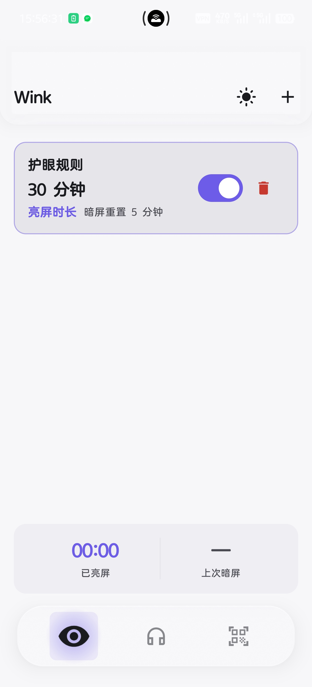
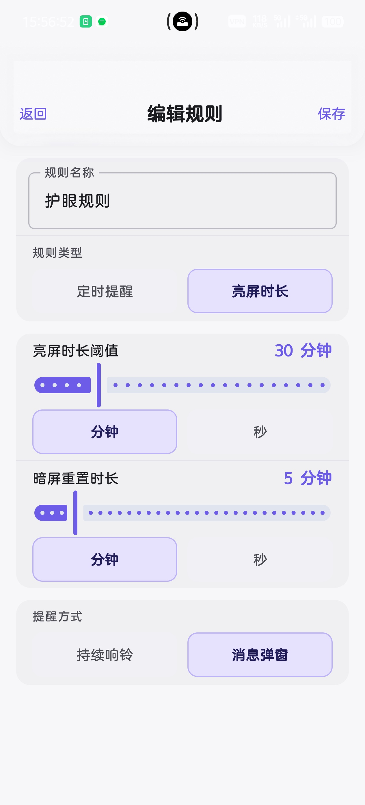
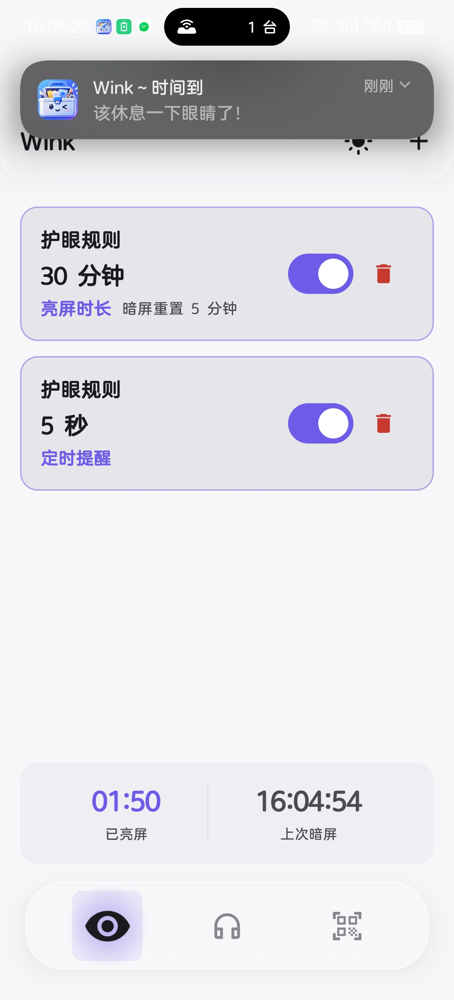
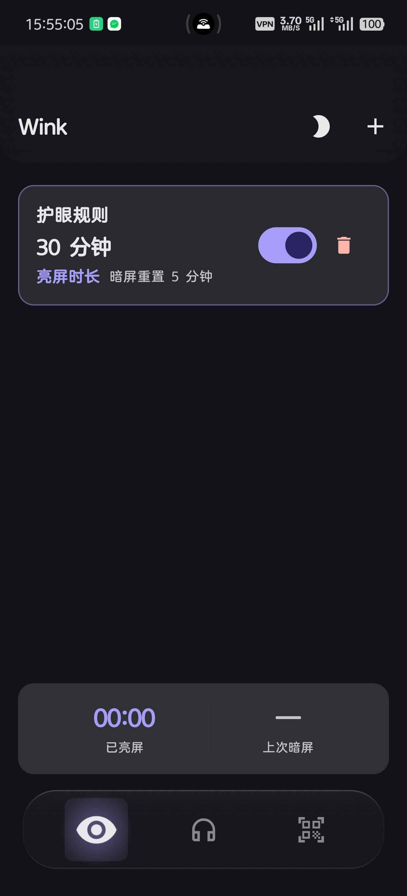
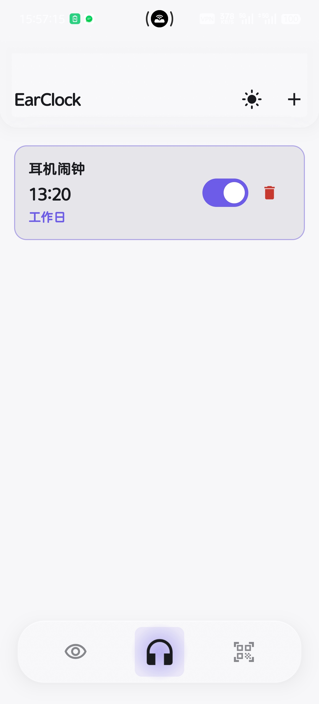
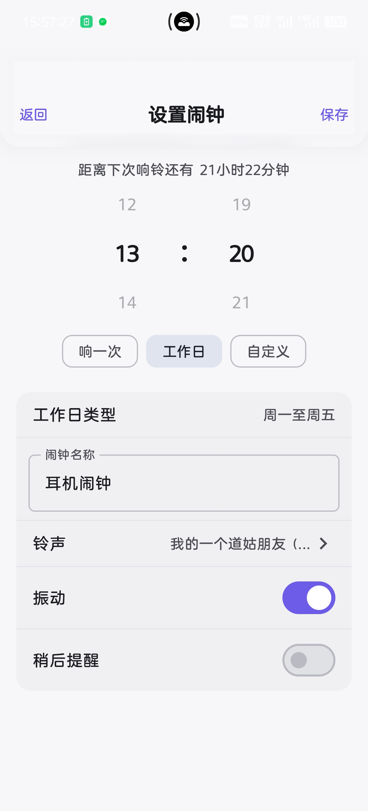
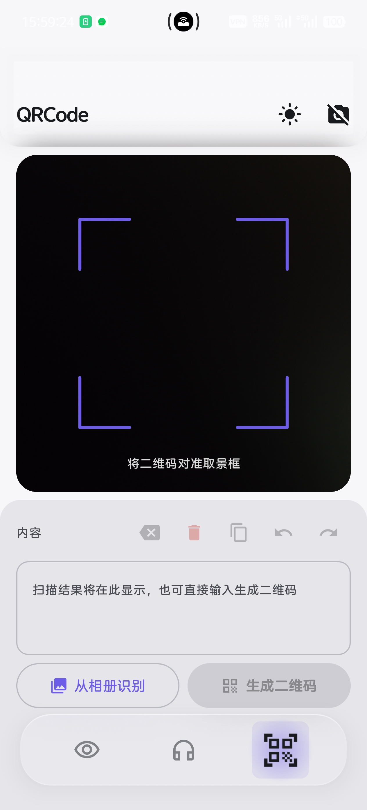
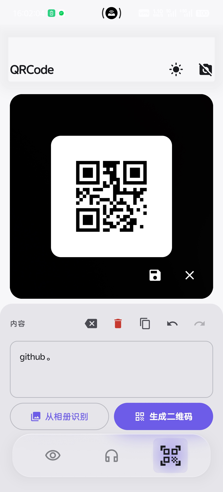

# Wink

一款 Android 小工具集合：**用眼提醒**、**耳机闹钟**、**二维码工具**。Jetpack Compose 全程声明式渲染，界面走液态玻璃（Liquid Glass）视觉。

## 界面预览

<table>
  <tr>
    <td align="center"><b>Wink · 首页</b></td>
    <td align="center"><b>规则编辑</b></td>
    <td align="center"><b>提醒弹窗</b></td>
    <td align="center"><b>暗色模式</b></td>
  </tr>
  <tr>
    <td></td>
    <td></td>
    <td></td>
    <td></td>
  </tr>
  <tr>
    <td align="center"><b>EarClock · 闹钟列表</b></td>
    <td align="center"><b>闹钟设置</b></td>
    <td align="center"><b>扫码</b></td>
    <td align="center"><b>生成二维码</b></td>
  </tr>
  <tr>
    <td></td>
    <td></td>
    <td></td>
    <td></td>
  </tr>
</table>

## 三个模块

底部悬浮玻璃导航栏切换三个 Tab，每页形态一致：玻璃顶栏 + 内容卡片 + 悬浮导航层。

### 1. Wink · 亮屏计时与用眼提醒

按规则提醒你休息眼睛，两种规则类型：

| 类型 | 触发条件 |
|------|----------|
| 定时提醒 | 固定间隔（秒/分钟）周期提醒，另附快捷预设 |
| 亮屏时长 | 连续亮屏累计达到阈值后提醒，暗屏超过设定时长则重置计时 |

- 规则卡片可单条开关、点击进入编辑、右滑删除
- 首页底部实时显示**已亮屏时长**与**上次暗屏时间**，每秒刷新
- 提醒方式二选一：**持续响铃**（全屏 + 循环铃声，手动关闭才停）或**消息弹窗**（高优先级通知 + 锁屏弹窗 + 振动）
- 亮屏计时由前台服务 + AlarmManager 双重保障，后台与 Doze 下依然准确

### 2. EarClock · 耳机闹钟

只在连接耳机时通过耳机播放闹铃，避免外放吵到别人。

- 按优先级挑选蓝牙输出（A2DP 优先于 SCO），有耳机时使用媒体音量通道播放
- 频率：响一次 / 工作日 / 自定义星期
- 铃声支持系统默认或本地自选音乐
- 振动开关、稍后提醒（可设间隔与最大次数）
- 使用 `AlarmManager.setAlarmClock()` 精确调度；开机后由接收器自动重排闹钟
- 后台直接唤起全屏响铃页，不依赖厂商通知策略

### 3. QRCode · 二维码工具

- 相机实时扫码（CameraX 取景 + ML Kit 识别，识别模型打包在 APK 内，无需 Google Play 服务）
- 从相册选图识别
- 输入文本即时生成二维码，可保存到相册 `Pictures/Wink`
- 切走 Tab 后编辑内容仍保留，不做本地历史记录

## 技术栈

| 项目 | 版本 |
|------|------|
| Kotlin | 2.1.0 |
| Android Gradle Plugin | 8.10.0 |
| Gradle | 8.13 |
| compileSdk / targetSdk | 36 |
| minSdk | 34（Android 14+） |
| Jetpack Compose + Material 3 | BOM 2024.12.01 |
| Navigation Compose | 2.8.5 |
| kotlinx-serialization | 1.7.3 |
| Haze（backdrop blur 玻璃层） | 1.6.10 |
| CameraX | 1.4.0 |
| ML Kit barcode-scanning | 17.3.0 |
| ZXing core | 3.5.3 |

技术选型说明：

- **Haze 停留在 1.x**：2.x 的折射玻璃要求 Kotlin 2.4 + AGP 9.1 + compileSdk 37，当前构建链不满足；折射与高光由自绘玻璃层补齐
- **ML Kit 用 bundled 版**：识别模型随 APK 分发（约 10MB），运行时不需要联网或 GMS

## 项目结构

```
app/src/main/java/com/wink/eye/
├── MainActivity.kt                 # 主入口 + 导航宿主 + 权限申请
├── ReminderActivity.kt             # 全屏响铃提醒页
├── EarClockAlarmActivity.kt        # 全屏闹钟响铃页
├── WinkApp.kt                      # Application
│
├── data/
│   ├── Rule.kt / RuleRepository.kt              # 用眼规则模型与持久化
│   └── EarClockAlarm.kt / EarClockRepository.kt # 闹钟模型与持久化
│
├── receiver/
│   └── ScreenReceiver.kt           # 屏幕亮灭广播
│
├── service/
│   ├── ScreenMonitorService.kt     # 亮屏计时前台服务
│   ├── ScreenTimeAlarmReceiver.kt  # 亮屏时长触发
│   ├── IntervalAlarmScheduler.kt / IntervalAlarmReceiver.kt  # 定时提醒调度
│   ├── ReminderHelper.kt           # 通知 / 全屏提醒发送
│   ├── EarClockAlarmScheduler.kt / EarClockAlarmReceiver.kt  # 闹钟调度
│   ├── EarClockRingingService.kt   # 响铃前台服务
│   ├── EarClockAudioHelper.kt      # 耳机路由与播放
│   └── BootCompletedReceiver.kt    # 开机重排闹钟
│
└── ui/
    ├── home/      HomeScreen / HomeViewModel          # Wink 页
    ├── edit/      EditScreen                          # 规则编辑
    ├── earclock/  EarClockHomeScreen / EarClockEditScreen
    ├── qrcode/    QrToolScreen / QrCameraCard / QrEditPanel / BarcodeAnalyzer / QrCodeRenderer / QrGallerySaver
    ├── components/ WinkConfigCard / WinkGlass         # 列表与玻璃层的唯一样式来源
    └── theme/     Theme.kt / Color.kt

com/compose/liquidglassnav/          # 通用悬浮玻璃底部导航栏
```

## 构建与运行

环境要求：JDK 17、Android SDK（compileSdk 36）。

```bash
./gradlew :app:assembleDebug     # 产物 app/build/outputs/apk/debug/app-debug.apk
./gradlew :app:installDebug      # 安装到已连接设备
```

日志：

```bash
adb logcat -s ScreenMonitorService IntervalAlarmReceiver EarClockAlarmReceiver EarClockRingingService ReminderHelper
```

## 发布

推 `v*` tag 触发 GitHub Actions，自动构建签名 APK 并创建 Release：

```bash
git tag -a v1.2.0 -m "Wink v1.2.0" && git push origin v1.2.0
```

- 版本名取自 tag（去掉 `v`），版本号取工作流运行序号，无需手工维护
- 产物：Release `vX.Y.Z` + 资产 `Wink-X.Y.Z.apk`

## 权限说明

| 分组 | 权限 |
|------|------|
| 提醒与调度 | `SCHEDULE_EXACT_ALARM`、`USE_EXACT_ALARM`、`WAKE_LOCK`、`POST_NOTIFICATIONS`、`USE_FULL_SCREEN_INTENT`、`SYSTEM_ALERT_WINDOW` |
| 前台服务 | `FOREGROUND_SERVICE`、`FOREGROUND_SERVICE_SPECIAL_USE`、`FOREGROUND_SERVICE_MEDIA_PLAYBACK` |
| 耳机闹钟 | `BLUETOOTH_CONNECT`、`RECEIVE_BOOT_COMPLETED`、`VIBRATE` |
| 二维码 | `CAMERA` |
