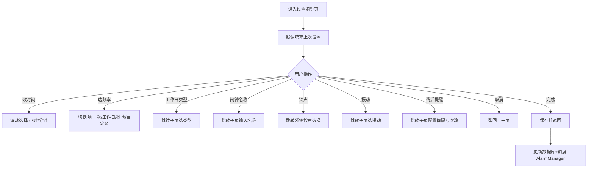

# EarClock 闹钟设置页 UI 设计文档

## 页面信息
- **页面名称**：设置闹钟
- **所属模块**：耳机闹钟 EarClock
- **设计稿状态**：已定稿（与 iOS 系统闹钟风格一致，深色模式预览）
- **关联项目**：Wink（Android/Kotlin/Compose）

---

## 1. 整体布局

页面采用 **顶部导航 + 倒计时提示 + 时间选择 + 频率切换 + 设置分组卡片** 的纵向结构。

| 区域 | 位置 | 说明 |
| --- | --- | --- |
| 顶部导航栏 | 顶部 | 左侧「取消」、中间标题「设置闹钟」、右侧「完成」 |
| 倒计时提示 | 导航栏下方 | 居中显示「距离下次响铃还有 18 小时 15 分钟」 |
| 时间选择器 | 上中部 | 双列滚轮（小时 / 分钟），同时显示上中下三项 |
| 频率切换 | 时间选择器下方 | 四个胶囊状分段切换选项 |
| 设置分组卡片 | 下半部分 | 工作日类型、闹钟名称、铃声、振动、稍后提醒 5 个设置项 |

---

## 2. 顶部导航栏

```
┌─────────────────────────────────────────────┐
│  取消                  设置闹钟          完成  │
└─────────────────────────────────────────────┘
```

- 左侧：**取消**（文字按钮，蓝色）
- 中间：**设置闹钟**（标题，浅色）
- 右侧：**完成**（文字按钮，蓝色）
- 行为：
  - 点击「取消」：返回上一页，丢弃未保存的修改。
  - 点击「完成」：保存设置，返回上一页。

---

## 3. 倒计时提示

- 文本：`距离下次响铃还有 18 小时 15 分钟`
- 样式：浅灰色小号字，水平居中
- 位置：顶部导航栏正下方
- 行为：随时间实时刷新显示

---

## 4. 时间选择器

```
        06          44
   ─────────────────────────
        07          45     ← 当前选中（高亮加粗）
   ─────────────────────────
        08          46
```

- 类型：双列独立滚轮（小时 00–23 / 分钟 00–59）
- 当前选中值：07 : 45
- 样式：
  - 未选中项：灰色细体
  - 选中项：白色加粗
  - 上下分隔线：用于强化选中行的范围
- 行为：滑动滚轮调整时间

---

## 5. 频率切换

```
┌──────────┐ ┌──────────┐ ┌──────────┐ ┌──────────┐
│  响一次  │ │ 工作日 ▲│ │秒抢闹钟  │ │  自定义  │
└──────────┘ └──────────┘ └──────────┘ └──────────┘
```

- 类型：单选胶囊（Chip）组，4 个互斥选项
- 当前选中：工作日（蓝色填充，白色文字）
- 未选中：深色背景，浅灰文字
- 选项：
  - **响一次**：仅在设定时刻触发一次
  - **工作日**：每周一到周五的设定时刻重复
  - **秒抢闹钟**：到达设定时刻后按秒/分钟级快速重复（待定）
  - **自定义**：选择一周内的若干天重复

---

## 6. 设置分组卡片

整体为一个深色圆角分组容器，内含多个设置项，每项由 **标题 + 副标题/值 + 右侧箭头** 组成，行间用细分隔线分开。

### 6.1 工作日类型
```
┌─────────────────────────────────────────────┐
│ 工作日类型                              > │
│ 法定工作日                                    │
└─────────────────────────────────────────────┘
```
- 标题：工作日类型
- 当前值：法定工作日
- 行为：点击进入子页面选择「法定工作日 / 自定义」等具体类型

### 6.2 闹钟名称
```
┌─────────────────────────────────────────────┐
│ 闹钟名称                                     │
└─────────────────────────────────────────────┘
```
- 标题：闹钟名称
- 当前值：无（留空占位）
- 行为：点击进入文字输入页

### 6.3 铃声
```
┌─────────────────────────────────────────────┐
│ 铃声                                       > │
│ 清净的森林(经典轻音乐)                          │
└─────────────────────────────────────────────┘
```
- 标题：铃声
- 当前值：清净的森林(经典轻音乐)
- 行为：点击进入系统铃声选择器

### 6.4 振动
```
┌─────────────────────────────────────────────┐
│ 振动                                       > │
│ 默认振动                                      │
└─────────────────────────────────────────────┘
```
- 标题：振动
- 当前值：默认振动
- 行为：点击选择振动模式（默认 / 关闭 / 自定义等）

### 6.5 稍后提醒
```
┌─────────────────────────────────────────────┐
│ 稍后提醒                                    > │
│ 已关闭                                        │
└─────────────────────────────────────────────┘
```
- 标题：稍后提醒
- 当前值：已关闭
- 行为：点击开启稍后提醒，可配置间隔与最大次数

---

## 7. 视觉规范

### 7.1 颜色
| 元素 | 颜色 |
| --- | --- |
| 页面背景 | 纯黑 `#000000` |
| 卡片背景 | 深灰 `#1C1C1E` |
| 主标题 / 选中文字 | 白色 `#FFFFFF` |
| 副标题 / 提示文字 | 中灰 `#8E8E93` |
| 分隔线 | 暗灰 `#38383A` |
| 主操作色（完成、选中 Chip） | 系统蓝 `#0A84FF` |
| 取消按钮 | 系统蓝 `#0A84FF` |

### 7.2 字号
| 元素 | 字号 | 字重 |
| --- | --- | --- |
| 页面标题 | 17 pt | Semibold |
| 倒计时提示 | 13 pt | Regular |
| 时间选择器选中 | 32 pt | Bold |
| 时间选择器未选 | 22 pt | Regular |
| Chip 文字 | 14 pt | Medium |
| 设置项标题 | 16 pt | Regular |
| 设置项副标题 | 13 pt | Regular |
| 导航按钮 | 17 pt | Regular |

### 7.3 间距
- 页面左右内边距：16 pt
- 时间选择器卡片内边距：上下 24 pt
- 设置项垂直内边距：12 pt
- 设置项水平内边距：16 pt
- 频率切换区与时间选择器/设置卡片之间间距：20 pt

### 7.4 圆角
- 卡片：14 pt
- Chip：18 pt（胶囊）
- 设置项行：随卡片圆角（无独立圆角）

---

## 8. 交互流程



---

## 9. 与 Wink 风格一致性说明

虽然本页采用 iOS 系统闹钟的深色视觉，但落地到 Wink（Android/Kotlin/Compose/Material3）时需做以下适配：

- 颜色映射到 Wink 护眼绿主题（亮色 `#2E7D32` / 暗色 `#6BFF8E`）。
- Chip 组件用 Material3 `FilterChip` 实现。
- 设置项行用 `Card` + `ListItem`（或 `Row` + 分隔线）实现。
- 时间选择器优先使用 Material3 `TimePicker`/`TimePickerDialog`，如需保留 iOS 风格滚轮再用第三方库或自绘 `LazyColumn`。
- 导航栏采用 Material3 `TopAppBar`（与现有 `HomeScreen`、`EditScreen` 一致）。

---

## 10. 文件输出

- 路径：`docs/earclock-alarm-design.md`
- 用途：EarClock「设置闹钟」页 UI 设计稿的可读归档，供设计/开发/测试参考。
